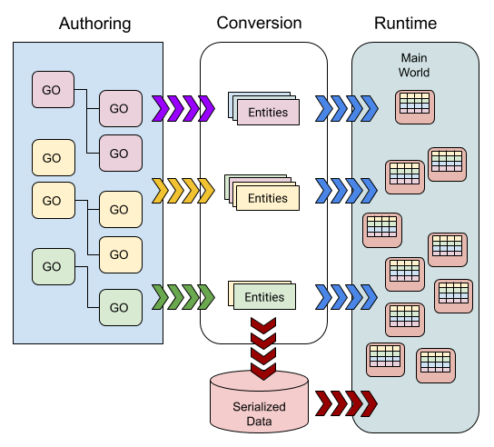

# Creating gameplay

This section contains information on how to create ECS-based games and other applications in the Unity Editor. It also covers the systems and components that ECS provides to help you implement game features.

The systems include:

* [Unity.Transforms](xref:Unity.Transforms): Provides components to define world-space transforms, 3D object hierarchies, and systems to manage them.
* [Unity.Hybrid.Renderer](https://docs.unity3d.com/Packages/com.unity.rendering.hybrid@latest): Provides components and systems to render ECS entities in the Unity runtime.

## Gameplay supporting packages

Some gameplay features require additional packages to support them. For the list of features that require additional packages, see the table below.

| **Feature** | **Packages** |
| --- | --- |
| Rendering | [Hybrid Renderer](https://docs.unity3d.com/Packages/com.unity.rendering.hybrid@latest) |
| Physics | [Unity Physics](https://docs.unity3d.com/Packages/com.unity.physics@latest) or [Havok Physics.](https://docs.unity3d.com/Packages/com.havok.physics@latest) |
| Multiplayer| [Netcode](https://docs.unity3d.com/Packages/com.unity.netcode@latest) |
| Project Building | [Platforms](https://docs.unity3d.com/Packages/com.unity.platforms@latest). For more information on building your application, see [Building your project](ecs_building_projects.md) |


## Authoring overview

You can use the Unity Editor (with the required DOTS packages) to create DOTS-based games. In the Editor, you use GameObjects as normal to author a Scene and the ECS code converts the GameObjects to entities. 

The biggest difference when you use DOTS is that instead of writing your own [MonoBehaviours](https://docs.unity3d.com/ScriptReference/MonoBehaviour.html) to store instance data and implement custom game logic, you define [ECS components](ecs_components.md) to store the data at runtime, and write [systems](ecs_systems.md) for the custom logic. 

### GameObject conversion

During GameObject conversion, various conversion systems handle the MonoBehaviour components that they recognize and then convert them into ECS-based components. For example, one of the the Unity.Transforms conversion systems examines the `UnityEngine.Transform` component and adds ECS components, such as [LocalToWorld](xref:Unity.Transforms.LocalToWorld), to replace it. 

You can implement an [IConvertGameObjectToEntity](xref:Unity.Entities.IConvertGameObjectToEntity) MonoBehaviour component to specify custom conversion steps. There often isn't a one-to-one relationship between the number of GameObjects ECS converts and the number of entities it creates; nor between the number of MonoBehaviours on a GameObject and the number of ECS components it adds to an entity. 



The ECS conversion code converts a GameObject if it either has a [ConvertToEntity](xref:Unity.Entities.ConvertToEntity) MonoBehaviour component, or if it is part of a SubScene. In either case, the conversion systems provided for various DOTS features, such as Unity.Transforms and Unity.Hybrid.Render, process the GameObject or the Scene Asset and any of their child GameObjects. 

One difference between converting GameObjects with ConvertToEntity and converting with a SubScene is that ECS serializes and saves to disk the entity data it generates from converting a SubScene. You can load or stream this serialized data very quickly at run time. In contrast, ECS always converts GameObjects with ConvertToEntity MonoBehaviours at runtime.

It's best practice to use standard MonoBehaviours to author, and use `IConvertGameObjectToEntity` to apply the values of those authoring components to [IComponentData](xref:Unity.Entities.IComponentData) structs for runtime use. Often, the most convenient data layout to use to author is not the most efficient data layout at runtime. 

You can use [IConvertGameObjectToEntity](xref:Unity.Entities.IConvertGameObjectToEntity) to customize the conversion of any GameObject in a SubScene, or a GameObject that has a `ConvertToEntity` MonoBehaviour, or one that is a child of a GameObject that has a `ConvertToEntity` MonoBehaviour.

> [!NOTE]
> The authoring workflow for DOTS-based applications is an area of active development. The general outlines are in place, but you should anticipate many changes in this area in the near future.

## Generated authoring components

Unity can automatically generate authoring components for simple runtime ECS components. When Unity generates an authoring component, you can add an add the script containing the ECS component directly to a GameObject within the Editor. You can then use the **Inspector** window to set the initial values for the component.

### For IComponentData

Unity can automatically generate authoring components for simple [IComponentData](xref:Unity.Entities.IComponentData) components. When Unity generates an authoring component, you can add an `IComponentData` directly to a GameObject in a Scene within the Unity Editor. You can then use the **Inspector** window to set the initial values for the component.

To tell Unity to generate an authoring component, add the `[GenerateAuthoringComponent]` attribute to the IComponentData declaration. Unity automatically generates a MonoBehaviour class that contains the public fields of the component and provides a Conversion method that converts those fields over into runtime component data.

```c#
[GenerateAuthoringComponent]
public struct RotationSpeed_ForEach : IComponentData
{
    public float RadiansPerSecond;
}
```

Note the following restrictions:

- Only one component in a single C# file can have a generated authoring component, and the C# file must not have another MonoBehaviour in it.
- ECS only reflects public fields and they have the same name as that specified in the component.
- ECS reflects fields of an Entity type in the IComponentData as fields of GameObject types in the MonoBehaviour it generates. ECS converts the GameObjects or Prefabs you assign to these fields as referenced Prefabs. 

### For IBufferElementData

You can also generate authoring components for types that implement `IBufferElementData` by adding the `[GenerateAuthoringComponent]` attribute: 
```c#
[GenerateAuthoringComponent]
public struct IntBufferElement: IBufferElementData
{
    public int Value;
}
```

In this example, a class named `IntBufferElementAuthoring` (which inherits from `MonoBehaviour`) is generated, exposing a public field of `List<int>` type. During conversion, this list will be converted into `DynamicBuffer<IntBufferElement>`, and then added to the converted entity.

Note the following restrictions:

- Only one component in a single C# file can have a generated authoring component, and the C# file must not have another MonoBehaviour in it.
- `IBufferElementData` authoring components cannot be automatically generated for types that contain 2 or more fields.
- `IBufferElementData` authoring components cannot be automatically generated for types that have an explicit layout.
